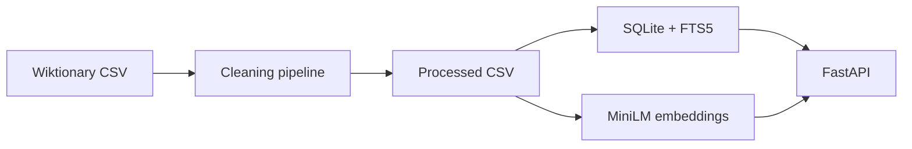

# Hiligaynon AI Lexicon

Python toolkit for a **Hiligaynon (Ilonggo)** lexical database: cleaning noisy dictionary extracts, storing a searchable lexicon, and semantic search over English glosses.

This is not a chatbot. It is a **low-resource language NLP** project: data cleaning, search, embeddings, evaluation, and an API.

## Status

Implemented:

- Wiktionary extract ingestion
- Cleaning, POS normalization, gloss cleanup, deduplication
- SQLite store with FTS5 full-text search
- MiniLM embeddings and cosine semantic search
- FastAPI lookup, keyword search, semantic search, and stats
- A small hand-labeled retrieval eval (actual metrics below)
- Documented source licenses and dataset limits

Not in this milestone yet:

- Wikipedia frequency counts
- Affix heuristics

## Overview

Hiligaynon has far less NLP tooling than English or Filipino. Dictionary pages exist, but scraped entries mix real lemmas with Wiktionary homographs (ISO language codes), category index rows, and noisy glosses.

This project turns a CC BY-SA Wiktionary extract into a reproducible lexicon with two retrieval modes:

1. **Keyword search** — SQLite FTS5 over lemma and gloss
2. **Semantic search** — cosine similarity over L2-normalized MiniLM vectors of `lemma: gloss`

Exact cosine over 1,933 vectors is equivalent to FAISS `IndexFlatIP` at this scale. FAISS would matter for millions of rows, not this corpus.



## Features

- Drop category index rows and ISO-code homograph pages
- Normalize part-of-speech labels
- Clean glosses (collapse whitespace, cut synonym/citation tails)
- Deduplicate `(lemma, POS, gloss)`
- Exact lemma lookup and FTS5 search
- Semantic search with `paraphrase-multilingual-MiniLM-L12-v2` (384-d)
- REST API: `/lookup`, `/search`, `/semantic-search`, `/stats`, `/health`

## Data sources

Public v1 uses **English Wiktionary Hiligaynon lemmas only**.

| Source | License | Used in public repo |
|---|---|---|
| [English Wiktionary](https://en.wiktionary.org/) Hiligaynon entries | [CC BY-SA 4.0](https://creativecommons.org/licenses/by-sa/4.0/) | Yes |
| Motus / Kaufmann dictionary PDFs | Unclear / likely copyrighted | **No** |

See [ATTRIBUTION.md](ATTRIBUTION.md).

## Cleaning results

| Metric | Count |
|---|---|
| Input rows | 1,987 |
| Kept rows | 1,933 |
| Unique lemmas | 1,673 |
| Dropped ISO homographs | 42 |
| Dropped duplicates | 8 |
| Dropped empty glosses | 4 |

POS after cleaning: noun 1,162 · verb 374 · adjective 316 · phrase 54 · determiner 15 · pronoun 12.

## Semantic retrieval evaluation

14 hand-labeled **English paraphrase** queries, written against real Wiktionary glosses. This is not a published benchmark.

Model: `paraphrase-multilingual-MiniLM-L12-v2`  
Index: L2-normalized vectors, exact cosine similarity

| Metric | Score |
|---|---|
| Queries | 14 |
| MRR | 0.6488 |
| Recall@1 | 0.5714 |
| Recall@5 | 0.7857 |
| Recall@10 | 0.7857 |

Queries that never hit in the top 10:

- “the part of the body where a belt sits” (expected `abayan`, gloss is “(anatomy) waist”)
- “a person with wide shoulders” (expected `abaganhan`; `abaga` “shoulder” ranked first)
- “unwilling to work” (expected `agdayan` / `maagol`, glosses are simply “lazy”)

Full per-query ranks: `data/processed/semantic_eval.json`.

## Limitations

- Coverage is incomplete (about 1.7k unique lemmas after cleaning).
- POS tags come from Wiktionary category membership and are sometimes wrong.
- ISO 639-3 homograph pages are dropped; some real Hiligaynon spellings may disappear with them (`kag` is an example).
- Semantic search depends on English glosses because Hiligaynon is not well represented in MiniLM.
- No morphological analyzer yet.

## Installation

```bash
python -m venv .venv
.venv\Scripts\activate
pip install -e ".[dev]"
```

The first semantic-search run downloads the MiniLM model from Hugging Face.

## Usage

```bash
python -m hiligaynon_lexicon.clean --input data/raw/wiktionary_hiligaynon.csv --output-dir data/processed
python -m hiligaynon_lexicon.db --input data/processed/lexicon.csv --output data/processed/lexicon.sqlite
python -m hiligaynon_lexicon.embed --db data/processed/lexicon.sqlite --output-dir data/processed
python -m hiligaynon_lexicon.eval_semantic
uvicorn hiligaynon_lexicon.api:app --reload
```

Then open http://127.0.0.1:8000/docs

```bash
curl "http://127.0.0.1:8000/lookup?lemma=abang"
curl "http://127.0.0.1:8000/search?q=window"
curl "http://127.0.0.1:8000/semantic-search?q=an%20opening%20in%20a%20wall%20for%20light"
curl "http://127.0.0.1:8000/stats"
```

- `/lookup` — exact lemma, case-insensitive
- `/search` — FTS5 keyword match on lemma and gloss
- `/semantic-search` — cosine nearest neighbors in embedding space

```bash
pytest
```

## Project structure

```text
src/hiligaynon_lexicon/   cleaning, SQLite, embeddings, API
data/raw/                 Wiktionary extract
data/processed/           CSV, SQLite, embeddings, eval report
data/eval/                labeled semantic queries
tests/                    unit and API tests
```

## License

- Code: [MIT](LICENSE)
- Lexical data derived from Wiktionary: CC BY-SA 4.0 (see ATTRIBUTION.md)
